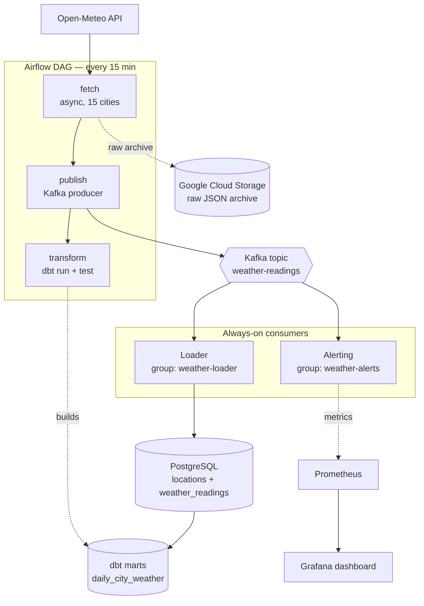
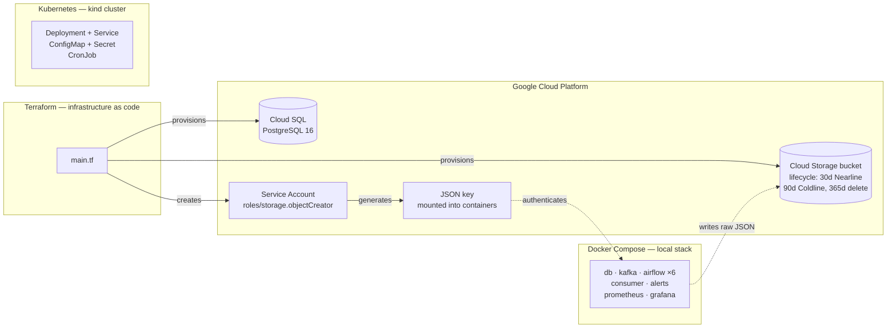
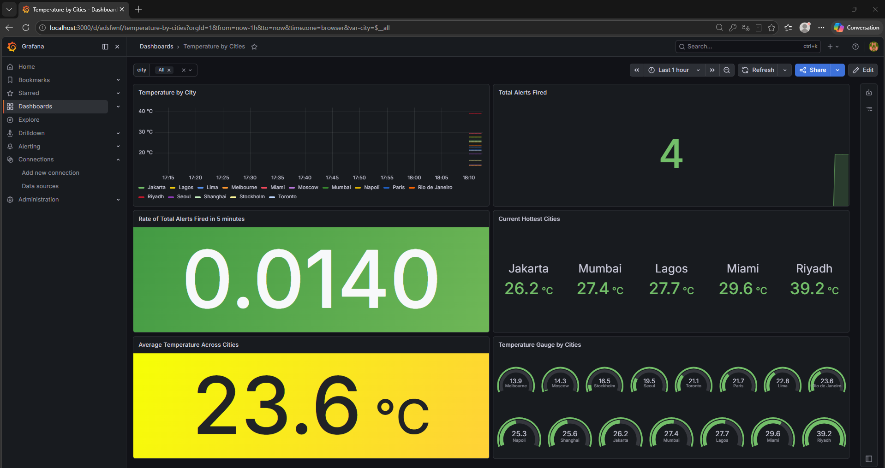
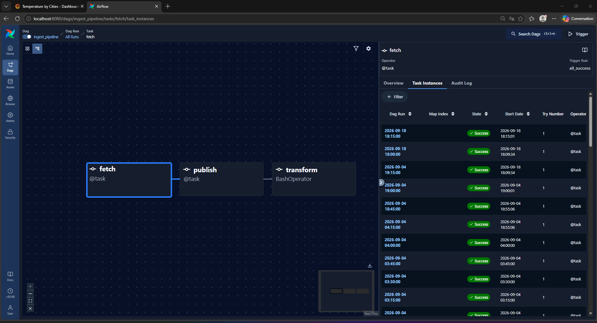
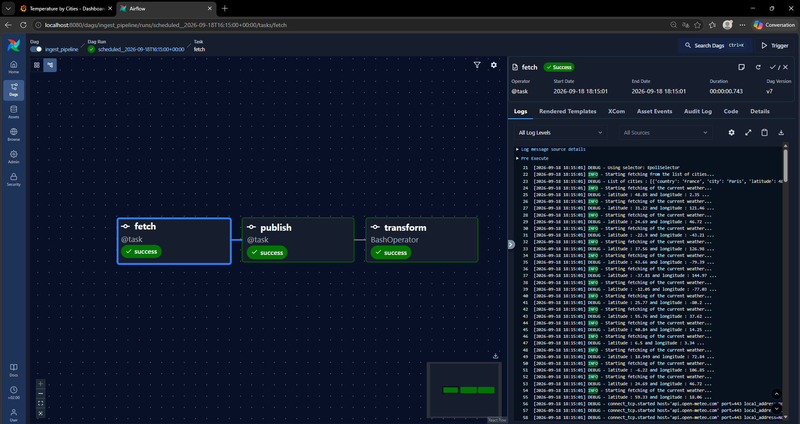
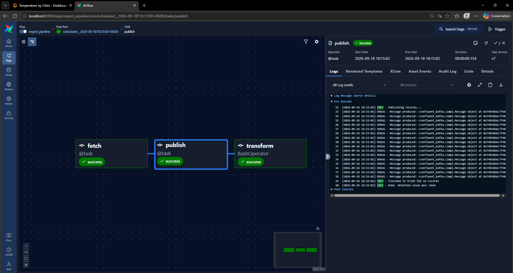
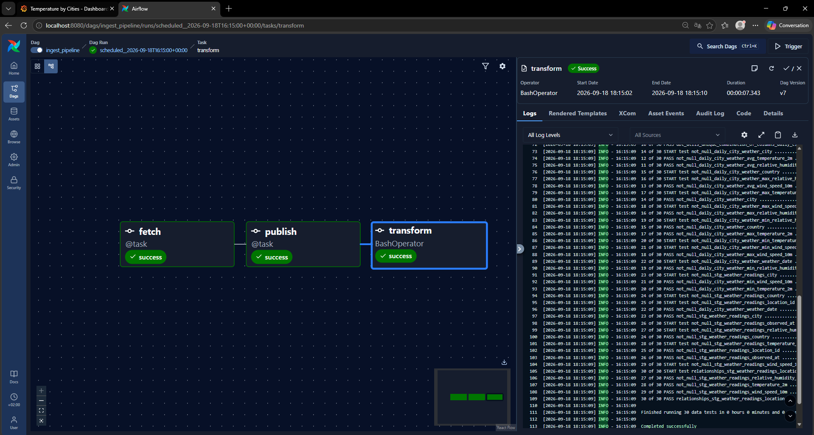
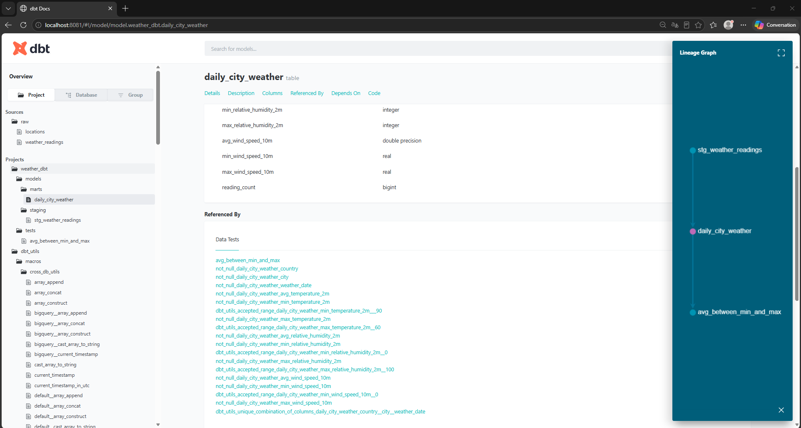
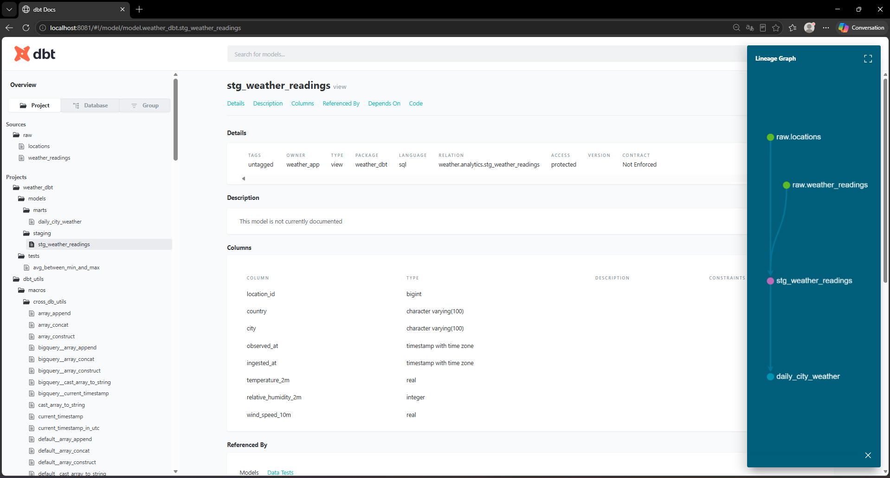

<!-- README.md -->

# Weather Data Platform

A production-shaped data platform: live weather from 15 cities, ingested asynchronously, streamed through Kafka, modelled in PostgreSQL with dbt, and visualised in Grafana.

[](https://github.com/Ryqn0/weather-platform/actions/workflows/tests.yml)


## What this is

An end-to-end data platform built to practice production data engineering patterns. It fetches current weather for 15 cities every 15 minutes, archives the raw responses to a cloud data lake, and flows the cleaned records through both a batch path (Airflow → dbt) and a streaming path (Kafka → independent consumers).


## Technical stack

- **Ingestion** — Python, httpx, asyncio
- **Storage** — PostgreSQL (star schema), Google Cloud Storage (raw lake)
- **Streaming** — Kafka (producer + two consumer groups)
- **Orchestration** — Airflow; Kubernetes CronJob
- **Transformation** — dbt (staging + marts, 30 data tests)
- **Infrastructure** — Docker Compose, Terraform, Kubernetes
- **Observability** — structured logging, Prometheus, Grafana
- **Quality** — pytest with respx mocking, GitHub Actions CI


## Architecture

### Data flow




### Infrastructure




## Getting started

```bash
git clone https://github.com/Ryqn0/weather-platform.git
cd weather-platform
cp .env.example .env        # fill in your values
docker compose up -d
```

| Service | URL | Credentials |
|---|---|---|
| Airflow | http://localhost:8080 | airflow / airflow |
| Kafka UI | http://localhost:8090 | — |
| Prometheus | http://localhost:9090 | — |
| Grafana | http://localhost:3000 | admin / admin |


### Tests

```bash
uv run pytest
```


### Optional: cloud infrastructure

Requires a GCP account with billing enabled.

```bash
cd terraform
terraform init
terraform plan      # review before applying
terraform apply
terraform destroy   # tear down when finished
```


## Screenshots
















## Design decisions

**Star schema.** Cities and readings live in separate tables. A city's coordinates
never change, so storing them on every reading would duplicate the same values
thousands of times.

**Idempotent loads.** Every insert uses `ON CONFLICT DO NOTHING` on a natural key.
Running the pipeline twice gives the same result as running it once, which is what
makes retries, backfills, and Kafka replay safe.

**Kafka with a polled source.** This is a gentle use of Kafka — the source is an
API polled every 15 minutes. The value is decoupling: two consumers
read the same topic independently, and adding a third needs no change to the
producer.

**Consumers as separate services.** A stream processor polls forever, so it can't
be an Airflow task, which is expected to finish. Airflow runs scheduled batch work;
the consumers react continuously alongside it.

**Async with a concurrency cap.** Fetching 15 cities is I/O bound, so `asyncio`
overlaps the waiting and 15 requests take about as long as one. A semaphore limits
it to 5 — firing all 15 at once triggered HTTP 429s.

## Known limitations

- Cluster Postgres has no PersistentVolumeClaim; data is lost on pod restart.
- Kubernetes Secrets are base64-encoded, not encrypted. Production would use a
  secret manager.
- Cloud SQL is provisioned by Terraform but the local stack uses a container.
  Switching is a `DB_HOST` change.
- Alerting fires per message. Production would window over time and deduplicate.